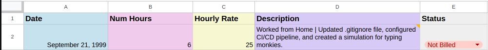
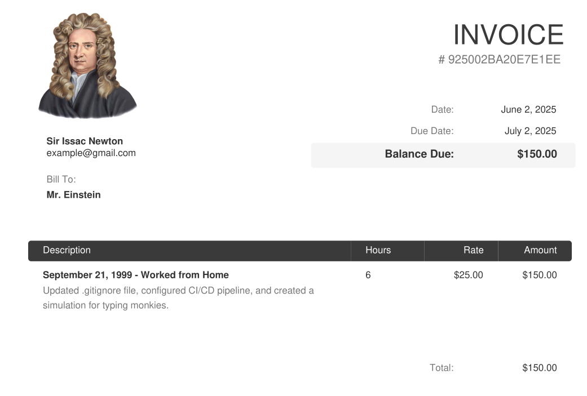

# Dodo Invoicer
Dodo invoicer is a Python script that creates PDF invoice files from "specially formatted" Google Sheets documents.

For example, you could turn this [google sheets document](https://docs.google.com/spreadsheets/d/119i_TgxH7HClOA-ZGKgXn9koN8eZDN9yHTTyrMUpH-8/edit?gid=0#gid=0) (see below):

... into this beautiful invoice for one of your _many_ clients.

## Setup
1. TODO